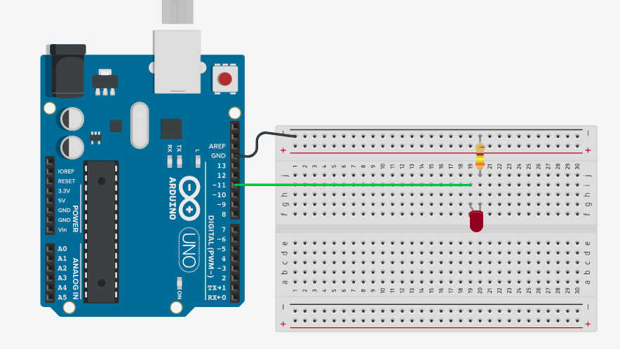

# Led

Ce programme à pour but de faire varier la luminosité d'une Led via les broches PWM

### Liste du matériel

- Une carte Arduino
- Une led 
- Une résistance entre 220 et 470 Ohms

### Schéma 

