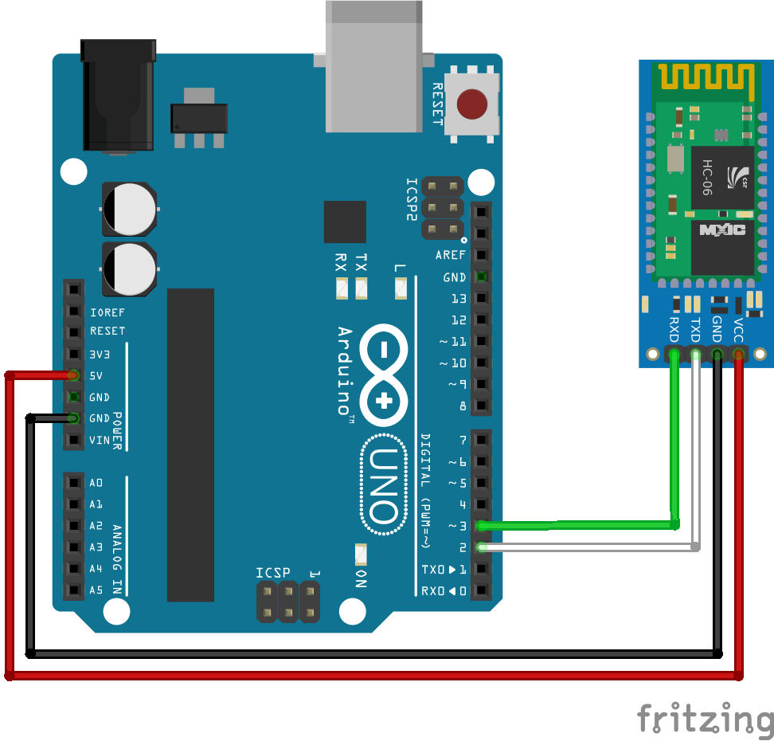

# Bluetooth

Ce code permet de tester la communication d'un module Bluetooth de type HC-05 (ou HC-06), Crius ou Xbee

## Principe

La carte Arduino va émuler une voie série afin de laisser la liasion UART native libre (possibilité d'utiliser la liasion série)

## Branchements

Il convient de mettre la broche RX du module sur la broche TX de la carte Arduino et la broche TX du module sur la broche RX de la carte.

- RX module -> Broche 3
- TX module -> Broche 2