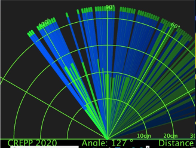
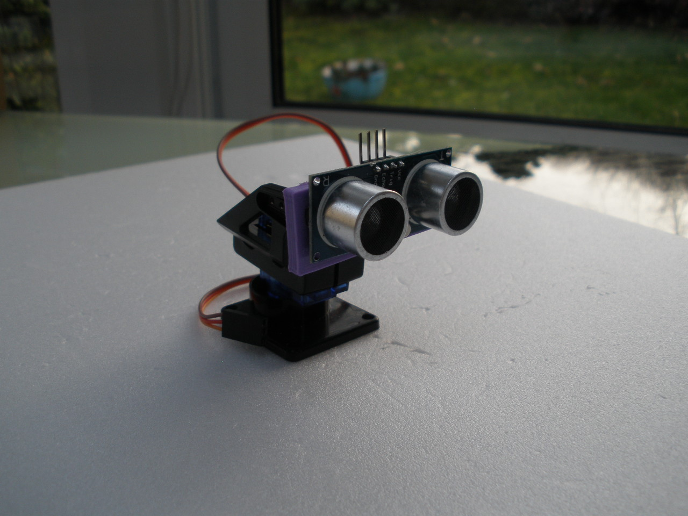

# Radar

Ce projet vise à simuler un radar avec un capteur de distance monté sur une tourelle.
Le logiciel processing gère l'affichage graphique.
Processing est un logiciel informatique pouvant intéragir avec des capteurs et une interface sur l'ordinateur

