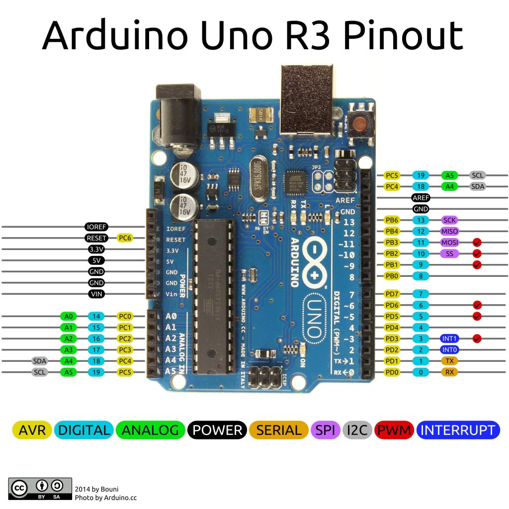

# Codes Arduino

## Sommaire

- Bases 

    Les codes pour découvrir les capteurs et éléments de base de l’Électronique

    - La syntaxe
    - Les leds

- Les bibliothèques spécifiques à certains projets 

- Les modules Bluetooth (liaison série) de type :

    - Crius
    - HC-06 ou HC-05
    - X-Bee

- des outils de débogage

    - Un scanner I2C
    - Positionner des servomoteurs

- Des mini-projets 

    - Un radar avec le capteur HC-SR04

- Moteurs et puissance

    Les codes pour contrôler les moteurs, servomoteurs et moteurs pas-à-pas

- Notions avancées

    Un code d'exemple pour les interruptions externes

## Branchement

## Rappels fonctions Arduino

Ces deux fonctions sont obligatoires dans tout programme en langage Arduino :

- void setup()
- void loop() 

Structures de contrôle

- if
- if...else
- for
- switch case
- while
- do... while
- break
- continue
- return 

Syntaxe de base

- ; (point virgule)
- {} (accolades)
- // (commentaire sur une ligne)
- /* */ (commentaire sur plusieurs lignes) 

Opérateurs arithmétiques

- = (égalité)
- + (addition)
- - (soustraction)
- * (multiplication)
- / (division)
- % (modulo) 

Opérateurs de comparaison

- == (égal à)
- != (différent de)
- < (inférieur à)
- > (supérieur à)
- <= (inférieur ou égal à)
- >= (supérieur ou égal à) 

Opérateurs booléens

- && (ET booléen)
- || (OU booléen)
- ! (NON booléen) 

Opérateurs composés

- ++ (incrémentation)
- -- (décrémentation) (à revoir)
- += (addition composée)
- -= (soustraction composée)
- *= (multiplication composée)
- /= (division composée) 

	
Variables et constantes

Les variables sont des expressions que vous pouvez utilisez dans les programmes pour stocker des valeurs, telles que la tension de sortie d'un capteur présente sur une broche analogique.
Constantes prédéfinies

Les constantes prédéfinies du langage Arduino sont des valeurs particulières ayant une signification spécifique.

- HIGH | LOW
- INPUT | OUTPUT
- true | false 

A ajouter : constantes décimales prédéfinies
Expressions numériques

- Expressions numériques entières 

Types des données

Les variables peuvent être de type variés qui sont décrits ci-dessous.

Synthèse des types de données Arduino

- boolean
- char
- byte
- int
- unsigned int
- long
- unsigned long
- float (nombres à virgules)
- double (nombres à virgules)
- Les chaînes de caractères
- Les tableaux de variables
- void (fonctions) 

Conversion des types de données

- char()
- byte()
- int()
- long()
- float() 

Référence

- Code ASCII (à finir) 

	
Fonctions
Entrées/Sorties Numériques

- pinMode(broche, mode)
- digitalWrite(broche, valeur)
- int digitalRead(broche) 

Entrées analogiques

- int analogRead(broche) 

Sorties "analogiques" (génération d'impulsion)

- analogWrite(broche, valeur) - PWM 

Entrées/Sorties Avancées

- tone()
- noTone()
- shiftOut(broche, BrocheHorloge, OrdreBit, valeur)
- unsigned long pulseIn(broche, valeur) 

Temps

- unsigned long millis()
- unsigned long micros()
- delay(ms)
- delayMicroseconds(us) 

Math

- min(x, y)
- max(x, y)
- abs(x)
- constrain(x, a, b)
- map(valeur, toLow, fromHigh, toLow, toHigh)
- pow(base, exposant)
- sq(x)
- sqrt(x) 

Trigonométrie

- sin(rad)
- cos(rad)
- tan(rad)
- degrees(rad)
- radians(deg)
- PI 

Nombres randomisés (hasard)

- randomSeed(seed)
- long random(max)
- long random(min, max) 

Communication

- Serial 
